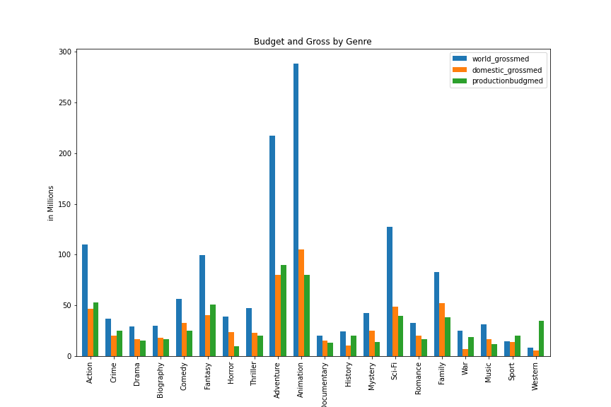
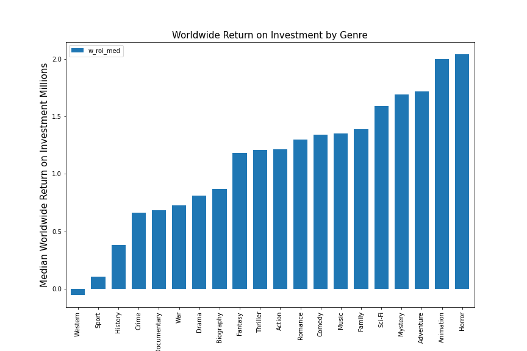
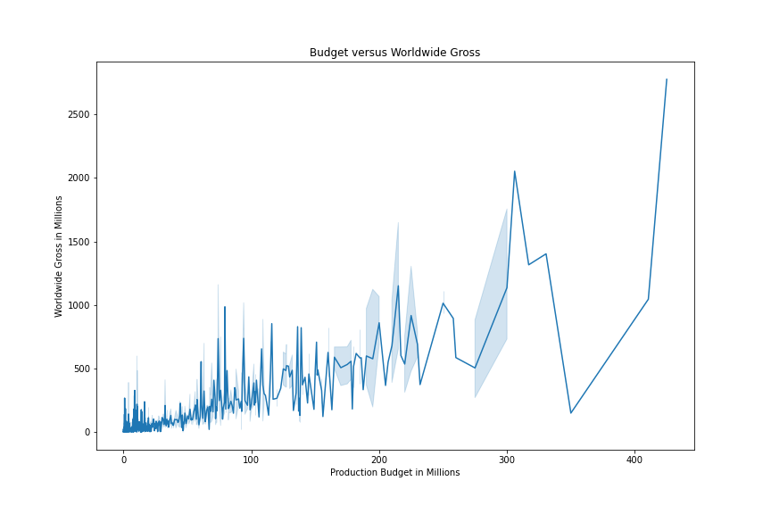

# Movie Profits Analysis 

## Overview

Microsoft has decided to create a movie studio and would like to do so in a profitable manner.  Descriptive analysis of boxoffice revenue, budget, ratings, and genres show differences in how different genres perform financially. Microsoft can use this information to decide what types of films to create. 

## Business Problem

Microsoft want to create a profitable movie studio. They want to know what types of films are currently doing the best at the box office in order to decide what films they want to create. Using data from IMDB and The Numbers, I analayzed which genres perform best in the worldwide and domestic markets, which ones more people review, and which have the highest return on investmest. This will help Microsoft enter the movie sector in a profitable manner. 

## Data

IMDB tracks movie titles, release year, length, and genres. They have several databases that link movies by ID. IMDB also allows users to rate movies, and keeps track of the average rating and number of reviewers per movie. 

The Numbers tracks release date, production budget, domestic gross, and worldwide gross for movies. 

## Methods

This project uses descriptive analysis to explore which genres are doing well at the box office and with number of reviews. 

## Results

Animation, adventure, and sci-fi are the three highest performing genres in the worldwide market, with median worldwide gross values significantly higher than median production budgets. Median domestic gross for adventure is below the median production budget, and the median domestic gross for animation is only slightly higher than median production budget. Therefore, we should focus on releasing movies worldwide.

In addition, horror movies have very low production budgets but high domestic and world gross revenue. For this reason, I recommend also making movies in the horror genre.

Horror and Animation have the highest median worldwide return on investments, followed by adventure, mystery, and sci-fi.  

## Conclusions

This analysis leads the following conclusions for entering the movie market:
* **Focus on releasing movies to a worldwide audience instead of just domestically.**  Gross revenues were much higher worldwide.  Domestic revenues were often just above production budget, or even below it. 
* **Focus on creating animation, adventure, and sci-fi movies.** These movies generate high box office revenue for the worldwide market.  However, adventure movies are riskier domestically. 
* **In addition, make horror movies.**  Horror movies require relatively low budgets and generate a very high return on investment both domestically and worldwide. 
* **Keep the budget at 200 million or below.** Budgets higher than 200 million carried greater risk. 

## Next Steps

Further analyses could yield even greater insights into profitable movie choices. 
* Further analysis of public perception in terms of favorite movies.   
* Analysis of streaming services.  Especially in terms of today's market and COVID, research should be done regarding releasing movies to streaming services instead of or in addition to box offices.  
* Analysis of awards and whether awards correlate with profits. 

## For More Information

Please review my full analysis in my [Jupyter Notebook](movie-analysis.ipynb) or my [presentation](Movie-Analysis-Presentation.pdf).

## Repository Structure
- README.md <- The top-level README for reviewers of this project. 
- movie-analysis.ipynb <- Narrative documentation of analysis in Jupyter Notebook
- Movie-Analysis-Presentation.pdf <- PDF version of project presentation 
- data <- Data used for the code
- Images <- images generated from the code 

